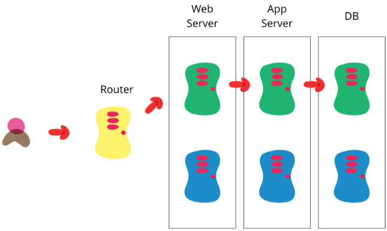
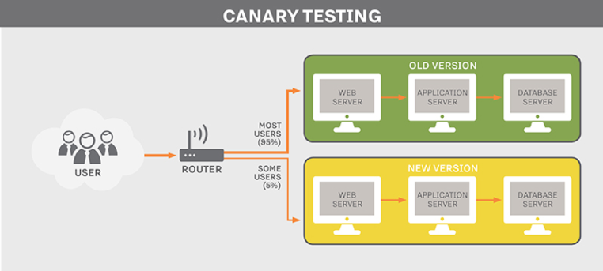
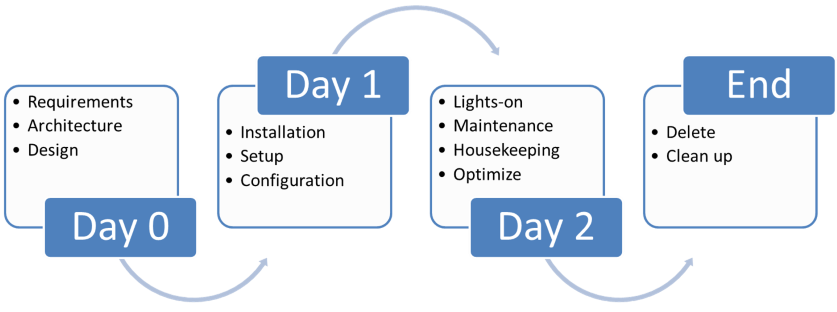

<!--
theme: gaia
class:
 - invert
headingDivider: 2 
paginate: true
-->

<!--
_class:
 - lead
 - invert
-->

# Infrastructure automation best practices

## What?

> Infrastructure automation is the use of technology that performs tasks with reduced human assistance in order to control the hardware, software, networking components, operating system (OS), and data storage components used to deliver information technology services and solutions.

→ [redhat.com](https://www.redhat.com/en/topics/automation/what-is-infrastructure-automation)

## Who?

This is a set of best practices from an **open community**.

Everyone is welcome to contribue through pull requests, issues and social media sharings!

→ [devops/presentations](https://github.com/devops/presentations)

## Infrastructure as Code (IaC)

> Infrastructure as Code is the management of infrastructure (networks, virtual machines, load balancers, and connection topology) in a descriptive model, using the same versioning as DevOps team uses for source code.
> Like the principle that the same source code generates the same binary, an IaC model generates the same environment every time it is applied.
> IaC is a key DevOps practice and is used in conjunction with continuous delivery.

→ [docs.microsoft.com](https://docs.microsoft.com/en-us/devops/deliver/what-is-infrastructure-as-code)

## Design principles

* **KISS** (Keep It Simple): take the time to use the easiest solution possible (vs. KICKME = Keep It Complicated Keep Me Employed)

* **Sharing**: documentation (no knowledge should be in people's head only), presentations, break silos

* **Resiliency**: build highly available systems, any task can be performed by more than one person (fight the "Heroe" mode)

* **State of the Art**: use the latest best practices and technologies

## Source code principles

* **DRY** (code): Don't Repeat Yourself

* **Open source / InnerSource** (model): shared components, everyone can contribute, high quality, ready to use, reusability

* **Craftmanship**: value quality and seek expertise

## Idempotence

> Idempotence is the property of certain operations whereby they can be applied multiple times without changing the result beyond the initial application

```txt
- Initial system state 1
- Call operation A => system state 2
- Call operation A => system state 2
- Call operation A => system state 2
- Call operation B => system state 3
```

:warning: All IaC source code MUST be **idempotent**!

## Markdown

> Markdown is a plain text format for writing structured documents, based on formatting conventions from email and usenet

→ [commonmark.org](https://commonmark.org/)

```md
# Title

## Chapter 1

Some _italic_ and **bold** element.
```

## Markdown quickstart

* [Learn Markdown in 60 seconds](https://commonmark.org/help/)
* [Markdown emojis](https://github.com/markdown-templates/markdown-emojis)
* `markdownlint`: [Visual Studio Code extension](https://marketplace.visualstudio.com/items?itemName=DavidAnson.vscode-markdownlint), [NPM CLI tool](https://github.com/igorshubovych/markdownlint-cli)
* [Make a README](https://www.makeareadme.com/)

## Frameworks

* [Ansible](./ansible.html)
* Chef
* Terraform

## Tools

* [git](./git.html)

## General knowledge

* Deployment strategies
  * Blue/Green deployments
  * Canary Releases
* Project lifecycle

## Blue/Green Deployments



## Canary Releases



## Project lifecycle



## That's all folks

We'll be glad to have your feedback and support:

→ [devpro.github.io/presentations/infrastructure-automation](https://devpro.github.io/presentations/infrastructure-automation)

Happy updates :smile:
